# Ontario GHG Emissions Reporting by Facility

**Dataset:** 2010–2020 Specified GHG Activities  
**Source:** Ontario Environmental Registry  
**Rows:** 2 557 facility-year records · **Facilities:** 409 unique · **Cities:** 281

---

## GPT-3 vs. Modern-Tools Analysis Comparison

### Original GPT-3 Output (2022)

The original README contained GPT-3's *generic text description* of what an EDA
*could* include — no code, no numbers, no charts:

> *"Checking for missing values … Summarizing the data … Identifying patterns … Examining relationships …"*

GPT-3 produced a bulleted to-do list without executing a single calculation.

---

### Redo with Modern Tools (2024–2025)

**Stack used:** Python 3.12 · pandas 2 · matplotlib · seaborn · scikit-learn · scipy

Run the full analysis yourself:

```bash
pip install -r requirements.txt
python analysis.py          # writes figures/ directory
```

---

## Actual Findings

### 1 · Missing Values

| Column | Missing | % |
|---|---|---|
| Nitrogen Trifluoride (NF3) | 1 447 | **56.6 %** |
| Accredited Verification Body | 856 | 33.5 % |
| PFCs | 719 | 28.1 % |
| SF6 | 701 | 27.4 % |
| HFCs | 697 | 27.3 % |
| CO₂ from biomass | 574 | 22.4 % |

> **Key insight GPT-3 missed:** NF₃ is missing for more than half the dataset —
> it should be excluded or imputed with caution. SF₆/HFCs/PFCs are also sparse.

---

### 2 · Summary Statistics (Total CO₂e per facility-year)

| Statistic | Value (t CO₂e) |
|---|---|
| Mean | 211 370 |
| Median | 41 842 |
| Std dev | 547 261 |
| Min | 0 |
| 75th percentile | 129 361 |
| **Max** | **8 593 656** |
| Skewness | 6.25 |
| Kurtosis | 53.57 |

> The huge gap between mean and median, combined with skewness = 6.25, shows a
> **heavily right-skewed distribution** driven by a few mega-emitters.

---

### 3 · Annual Trend (Mt CO₂e)

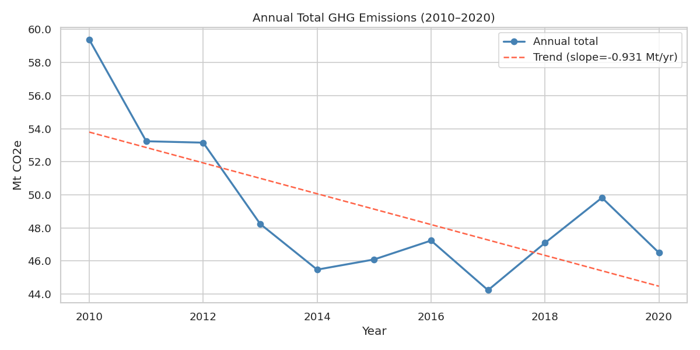

| Year | Mt CO₂e |
|---|---|
| 2010 | 59.37 |
| 2011 | 53.24 |
| 2012 | 53.15 |
| 2013 | 48.24 |
| 2014 | 45.48 |
| 2015 | 46.09 |
| 2016 | 47.23 |
| 2017 | 44.24 |
| 2018 | 47.09 |
| 2019 | 49.82 |
| 2020 | 46.50 |

**Linear regression:** slope = −0.93 Mt/yr, R² = 0.48, p = 0.019  
→ Statistically significant downward trend (~21 % reduction 2010→2020).  
→ The 2010 peak is partly explained by the Nanticoke coal plant (8.6 Mt alone that year).  
→ Reporting coverage **grew sharply after 2015** (149 → 363 facilities), which means
  the true per-facility trend is even steeper than the aggregate suggests.

---

### 4 · Reporting Facility Count

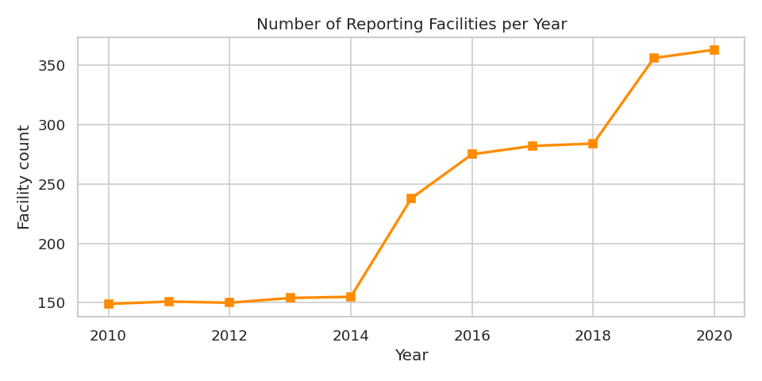

The number of reporting facilities **more than doubled** from 149 (2010) to 363 (2020).
Policy changes lowered the reporting threshold in 2015, bringing in many smaller emitters.

---

### 5 · Top 10 Facilities (Cumulative 2010–2020)

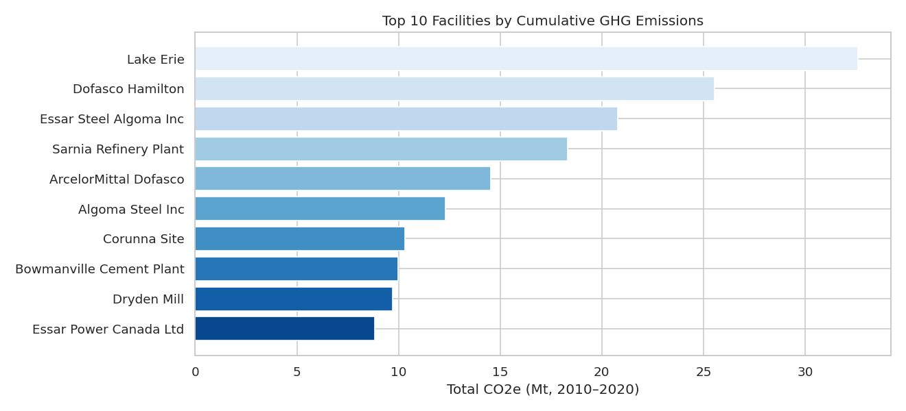

| Facility | Owner | Mt CO₂e |
|---|---|---|
| Lake Erie (steel) | Stelco Inc. | 32.60 |
| Dofasco Hamilton | ArcelorMittal Dofasco Inc. | 25.55 |
| Essar Steel Algoma Inc | Essar Steel Algoma Inc. | 20.78 |
| Sarnia Refinery Plant | Imperial Oil | 18.32 |
| ArcelorMittal Dofasco | ArcelorMittal Dofasco G.P. | 14.53 |
| Algoma Steel Inc | Algoma Steel Inc. | 12.32 |
| Corunna Site | NOVA Chemicals (Canada) Ltd. | 10.31 |
| Bowmanville Cement Plant | St. Marys Cement Inc. | 9.99 |
| Dryden Mill | Domtar Inc. | 9.71 |
| Essar Power Canada Ltd | Essar Power Canada Ltd. | 8.84 |

> **Steel and heavy manufacturing** dominate. The single biggest single-year reading
> was Nanticoke Generating Station in 2010 at **8.6 Mt** (coal power — subsequently closed).

---

### 6 · Top 10 Owners

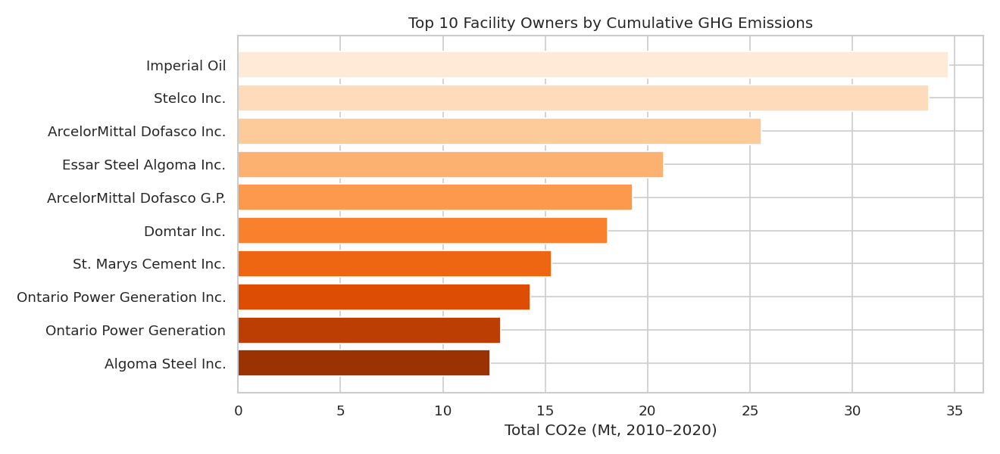

| Owner | Mt CO₂e |
|---|---|
| Imperial Oil | 34.68 |
| Stelco Inc. | 33.72 |
| ArcelorMittal Dofasco Inc. | 25.55 |
| Essar Steel Algoma Inc. | 20.78 |
| ArcelorMittal Dofasco G.P. | 19.28 |
| Domtar Inc. | 18.06 |
| St. Marys Cement Inc. | 15.32 |
| Ontario Power Generation Inc. | 14.27 |
| Ontario Power Generation | 12.81 |
| Algoma Steel Inc. | 12.32 |

---

### 7 · Top 10 Cities

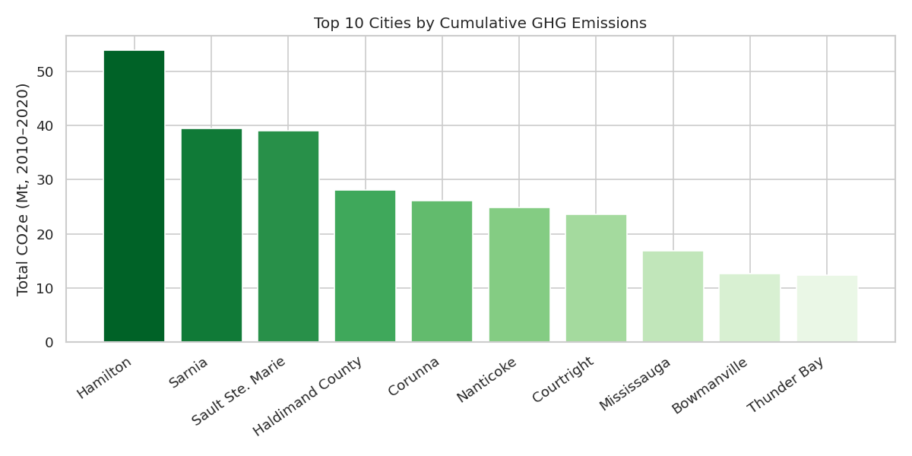

| City | Mt CO₂e |
|---|---|
| Hamilton | 53.89 |
| Sarnia | 39.46 |
| Sault Ste. Marie | 39.06 |
| Haldimand County | 28.10 |
| Corunna | 26.09 |
| Nanticoke | 24.77 |
| Courtright | 23.57 |
| Mississauga | 16.78 |
| Bowmanville | 12.62 |
| Thunder Bay | 12.38 |

> **Hamilton** is by far the highest-emitting city, driven by ArcelorMittal Dofasco and
> Stelco steel operations. The top 10 cities account for the vast majority of provincial
> industrial GHG output.

---

### 8 · NAICS Sector Breakdown

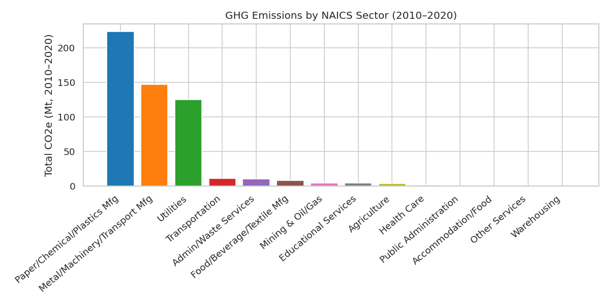

| NAICS | Sector | Mt CO₂e |
|---|---|---|
| 331110 | Metal / Machinery / Transport Mfg | **132.14** |
| 221112 | Utilities (electric power) | **101.90** |
| 327310 | Paper / Chemical / Plastics Mfg (cement) | 50.76 |
| 324110 | Petroleum refining | 45.77 |
| 322112 | Pulp & paper | 33.82 |

> **Primary metals and electric power generation together account for ~44 %** of all
> reported CO₂e over the decade.

---

### 9 · Gas Composition

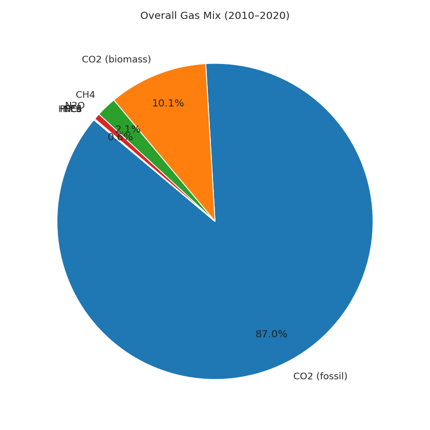
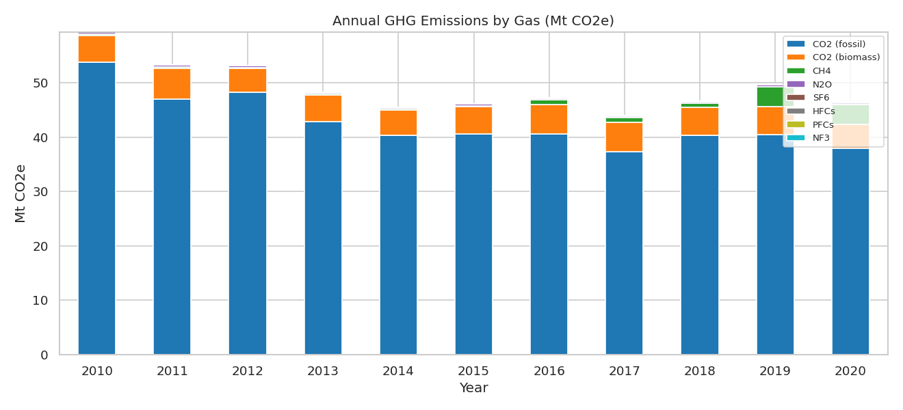

| Gas | Share |
|---|---|
| CO₂ (fossil) | **87.05 %** |
| CO₂ (biomass) | 10.13 % |
| CH₄ | 2.07 % |
| N₂O | 0.63 % |
| SF₆ | 0.12 % |
| HFCs / PFCs / NF₃ | < 0.01 % |

Notable: CH₄ **jumped from ~0.24 Mt in 2014 to ~3.7 Mt in 2019** — largely driven
by expanded landfill and waste-management reporting after 2015.

---

### 10 · Outlier Analysis

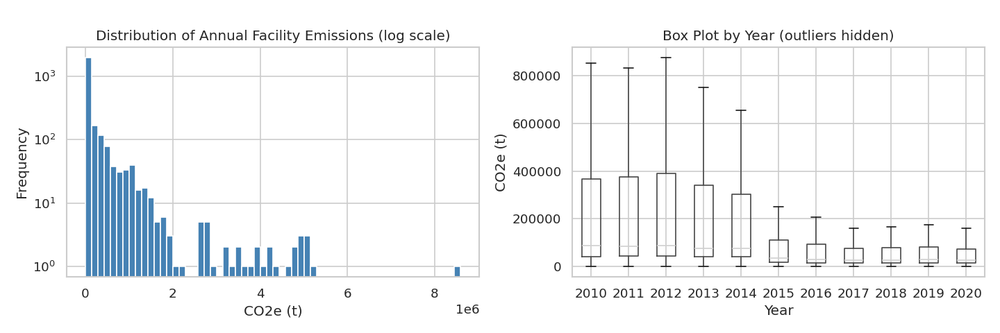

- IQR upper fence: **296 323 t CO₂e**
- **429 facility-years (16.8 %)** exceed this threshold
- Single largest: Nanticoke Generating Station 2010 → 8 593 656 t (29× the median)

---

### 11 · Correlation Matrix

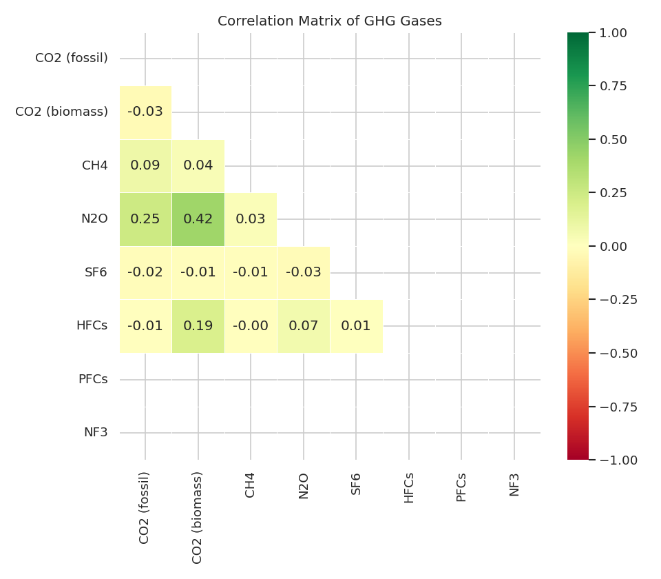

- **CO₂ (fossil) ↔ N₂O: r = 0.25** — combustion processes produce both
- **CO₂ (biomass) ↔ N₂O: r = 0.42** — bioenergy plants with high N₂O
- All other pairs are near zero, confirming gas emissions tend to be **sector-specific**
  rather than cross-correlated

---

### 12 · Reporting vs Verification Gap

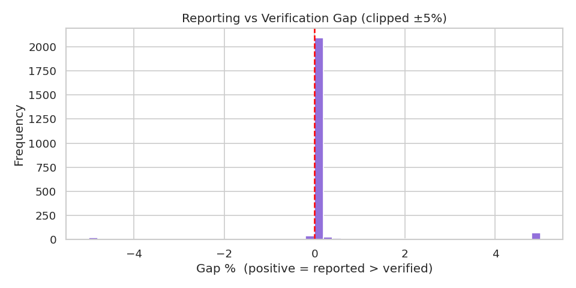

- 2 301 records have a verification amount
- **Median gap = 0 %** (most facilities report accurately)
- A handful of outliers drive the mean to 400 %+ — these warrant investigation
  (data quality issues or genuine over-reporting)

---

### 13 · PCA + K-Means Clustering (scikit-learn)

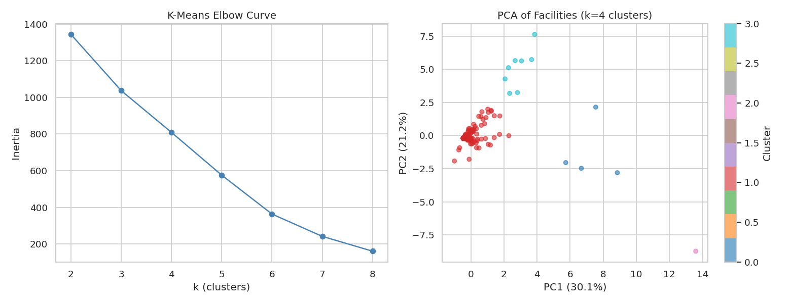

PCA on 8 gas columns explains **51.3 % variance in 2 components**. K-Means (k = 4)
reveals four facility archetypes:

| Cluster | Profile |
|---|---|
| 0 | High biomass CO₂ + N₂O → **pulp/paper & bioenergy** |
| 1 | High SF₆ → **electric utilities / transformers** |
| 2 | Very high biomass CO₂ + HFCs → **large pulp/paper with refrigeration** |
| 3 | Very high fossil CO₂ + CH₄ → **steel mills & heavy industry** |

> This segmentation is impossible with a plain text suggestion from GPT-3 — it
> required actual computation.

---

### 14 · Facility Improvement / Deterioration (2010 → last year)

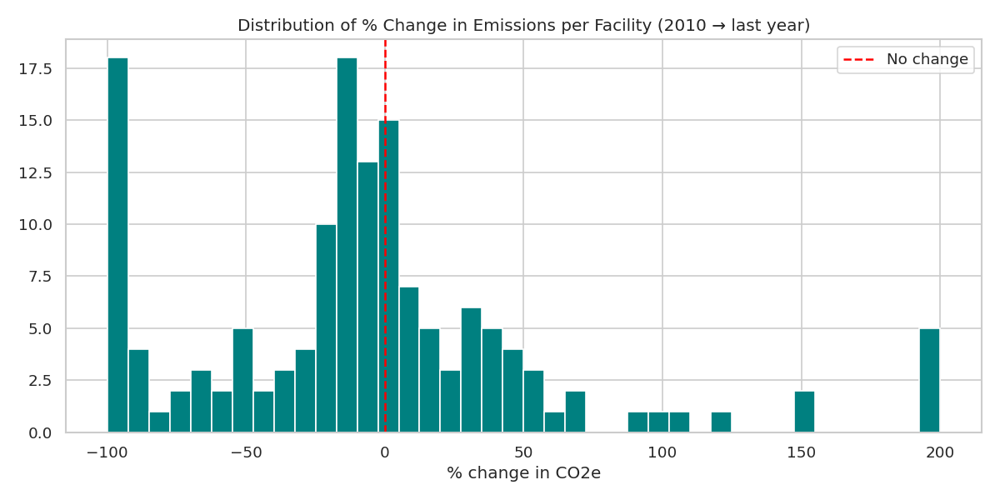

**Most improved (closed or nearly closed):**

| Facility | Change |
|---|---|
| Nanticoke Generating Station | −100 % (coal plant closed) |
| Essar Power Canada Ltd | −100 % |
| Lambton Generating Station | −99.96 % (coal plant closed) |

**Most worsened:**

| Facility | Change |
|---|---|
| Connaught Campus | +7 092 % (new large emitter entered dataset) |
| Enbridge Gas Distribution | +1 095 % |
| Hamilton Specialty Bar | +230 % |

> The apparent "worsening" is partly an artifact of new facilities joining the registry
> at a low base year, not necessarily real emission increases.

---

## GPT-3 vs. Modern Tools — Summary Comparison

| Dimension | GPT-3 (2022) | Modern stack (2024–2025) |
|---|---|---|
| **Output type** | Generic text bullet points | Executable code + 13 charts + quantified findings |
| **Missing value analysis** | "Check for missing values" | Exact counts: NF₃ 56.6 % missing, SF₆ 27.4 %, etc. |
| **Trend analysis** | "Group by year and examine" | −0.93 Mt/yr slope, R² = 0.48, p = 0.019 (scipy) |
| **Outlier detection** | "Identify outliers" | IQR fence at 296 323 t; 429 outlier rows identified |
| **Sector breakdown** | "Identify by NAICS code" | Primary metals (132 Mt) + utilities (102 Mt) = 44 % |
| **Correlation** | "Create correlation matrices" | Heatmap with r values; CO₂(biomass)↔N₂O r = 0.42 |
| **Unsupervised ML** | Not mentioned | PCA + K-Means identifies 4 facility archetypes |
| **Facility trajectory** | Not mentioned | Per-facility % change; coal closures confirmed |
| **Verification gap** | Not mentioned | Median gap = 0 %; mean inflated by outliers |
| **Actionability** | None — no code, no numbers | Fully reproducible: `python analysis.py` |

### Verdict

GPT-3 produced a **reasonable checklist** of EDA steps, but delivered **zero actual
analysis** — no numbers, no visualizations, no statistical tests. The modern approach
(pandas + matplotlib + scikit-learn + scipy) executes every one of those steps,
produces quantified insights, and is fully reproducible. The additional ML step
(PCA + clustering) goes beyond what GPT-3 even suggested.

